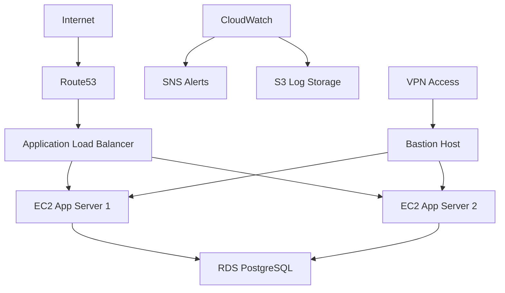

# AWS Certified Solutions Architect – Associate  
# Real World Enterprise AWS Project

## Project Name
# SecureKart Enterprise AWS Infrastructure

A production-style AWS cloud infrastructure project designed to cover:

- VPC
- EC2
- IAM
- S3
- RDS
- Route53
- VPN
- Load Balancer
- Auto Scaling
- Monitoring
- WAF
- Security Hardening
- Backup & Disaster Recovery
- Terraform

---

# Final Architecture

```text
                     INTERNET
                          |
                    Route 53 + ACM
                          |
                    Application LB
                   /               \
          App Server 1         App Server 2
             Private              Private
                   \               /
                     RDS PostgreSQL
                          |
                    Private DB Subnet

      Bastion Host ---- VPN Access ---- Admin Access

            CloudWatch + CloudTrail + SNS
                          |
                        S3 Logs
```

---

# Architecture Diagram



---

# Project Duration

| Phase | Days |
|---|---|
| AWS Account + IAM | 1 |
| Networking (VPC) | 2 |
| EC2 + Linux | 2 |
| Load Balancer + ASG | 2 |
| RDS Database | 2 |
| S3 + IAM Security | 2 |
| Monitoring + Logging | 2 |
| Route53 + HTTPS | 1 |
| VPN + Bastion | 2 |
| WAF + Security | 2 |
| Backup + Recovery | 1 |
| Terraform Basics | 3 |
| Final Testing + Documentation | 2 |

### Total Duration:
# 20–24 Days

---

# DAY 1 — AWS ACCOUNT HARDENING

## Tasks

- Enable MFA for Root Account
- Create IAM Admin User
- Configure Billing Alerts
- Install AWS CLI
- Install VS Code
- Create Project Folder Structure

---

# Project Folder Structure

```bash
AWS-SecureKart-Project/
│
├── screenshots/
├── notes/
├── architecture/
├── terraform/
├── monitoring/
├── scripts/
└── README.md
```

---

# DAY 2–3 — NETWORKING FOUNDATION

## Topics Covered

- VPC
- CIDR
- Subnets
- Internet Gateway
- NAT Gateway
- Route Tables
- Security Groups
- NACL

---

# VPC Design

## VPC CIDR

```text
10.0.0.0/16
```

---

# Subnet Design

| Subnet | CIDR | Purpose |
|---|---|---|
| Public-1 | 10.0.1.0/24 | ALB + Bastion |
| Private-App-1 | 10.0.2.0/24 | App Servers |
| Private-DB-1 | 10.0.3.0/24 | Database |
| Public-2 | 10.0.4.0/24 | HA |
| Private-App-2 | 10.0.5.0/24 | HA |
| Private-DB-2 | 10.0.6.0/24 | HA |

---

# DAY 4–5 — EC2 + LINUX

## Build

| Server | Purpose |
|---|---|
| Bastion Host | Secure SSH |
| App Server 1 | Web App |
| App Server 2 | Web App |
| Monitoring Server | Monitoring |

---

# Installations

```bash
sudo apt update
sudo apt install nginx docker.io git -y
```

---

# Security Hardening

- Disable password authentication
- Use SSH key authentication
- Configure Security Groups
- Configure Fail2Ban
- Enable CloudWatch Agent

---

# DAY 6–7 — LOAD BALANCER + AUTO SCALING

## Services

- Application Load Balancer
- Auto Scaling Group
- Target Groups
- Health Checks

---

# Auto Scaling Configuration

| Setting | Value |
|---|---|
| Minimum | 2 |
| Desired | 2 |
| Maximum | 5 |

---

# DAY 8–9 — DATABASE LAYER

## Database

- Amazon RDS PostgreSQL
- Multi-AZ Enabled
- Encryption Enabled
- Private Subnet Only

---

# Security

- No Public Access
- Restricted Security Groups
- Automated Backups Enabled

---

# DAY 10–11 — S3 + IAM + STORAGE

## S3 Buckets

| Bucket | Purpose |
|---|---|
| securekart-logs | Logs |
| securekart-backups | Backups |
| securekart-static | Static Files |

---

# S3 Security

- Block Public Access
- Enable Versioning
- Enable Encryption
- Configure Lifecycle Policies

---

# DAY 12–13 — MONITORING + LOGGING

## AWS Services

- CloudWatch
- CloudTrail
- SNS
- AWS Config

---

# Monitoring Targets

- CPU Usage
- Memory Usage
- Failed SSH Logins
- API Activity
- Billing Alerts

---

# DAY 14 — DOMAIN + HTTPS

## Configure

- Route53 Hosted Zone
- ACM SSL Certificate
- HTTPS Redirection
- ALB SSL Termination

---

# DAY 15–16 — VPN + BASTION SECURITY

## Build

- Bastion Host
- OpenVPN or AWS Client VPN
- Private Subnet Access

---

# DAY 17–18 — SECURITY HARDENING

## Implement

- AWS WAF
- AWS Shield
- GuardDuty
- KMS Encryption
- Secrets Manager

---

# DAY 19 — BACKUP + DISASTER RECOVERY

## Implement

- EC2 AMI Backup
- RDS Snapshots
- S3 Versioning
- Recovery Testing

---

# DAY 20–22 — TERRAFORM

## Infrastructure as Code

Convert:
- VPC
- EC2
- Security Groups
- RDS
- IAM

into Terraform code.

---

# DAY 23–24 — FINALIZATION

## Prepare

- GitHub Repository
- Resume Project Description
- Architecture Diagram
- Troubleshooting Notes
- Screenshots

---

# Resume Description

## Secure Multi-Tier AWS Infrastructure with Security Hardening

- Designed and deployed highly available AWS infrastructure using VPC, EC2, ALB, Auto Scaling, and RDS.
- Implemented secure private/public subnet architecture with NAT Gateway and Bastion Host.
- Configured IAM least privilege policies, CloudTrail auditing, CloudWatch monitoring, and AWS WAF.
- Secured applications using HTTPS, ACM certificates, VPN access, and encrypted storage.
- Automated infrastructure provisioning using Terraform.

---

# AWS Services Covered

| Service | Covered |
|---|---|
| VPC | YES |
| EC2 | YES |
| IAM | YES |
| RDS | YES |
| S3 | YES |
| Route53 | YES |
| CloudWatch | YES |
| CloudTrail | YES |
| ACM | YES |
| WAF | YES |
| Auto Scaling | YES |
| ALB | YES |
| SNS | YES |
| VPN | YES |
| Terraform | YES |

---

# Real World Problems To Practice

| Problem | Skill |
|---|---|
| Website Down | ALB Troubleshooting |
| DB Unreachable | Security Groups |
| SSH Failure | Routing + SG |
| High CPU | Auto Scaling |
| Public S3 Leak | Security |
| SSL Expired | ACM |
| VPN Failed | Routing |

---

# Important Notes

- Do NOT use default VPC
- Do NOT allow unrestricted SSH access
- Use least privilege IAM
- Always enable monitoring
- Take screenshots of every phase
- Document all troubleshooting

---

# GitHub Repository Suggestions

## Recommended Repository Name

```text
aws-securekart-enterprise-project
```

## Recommended Branches

```text
main
development
terraform
```

---

# Final Goal

After completing this project you should be able to:

- Crack AWS Cloud interviews
- Explain real-world architecture
- Troubleshoot AWS networking
- Understand security best practices
- Build production-style AWS infrastructure
- Add strong AWS experience to your resume
